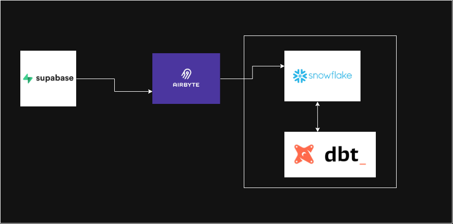

# Olist E-Commerce Analytics Platform

## 📌 Project Overview

This project is an end-to-end data engineering and analytics platform built using the Olist Brazilian e-commerce dataset.

The goal is to transform a collection of separate e-commerce datasets into a centralized, reliable, and analytics-ready data platform.

The project follows an ELT-oriented architecture:

```text
Olist CSV Files
       ↓
    Supabase
       ↓
    Airbyte
       ↓
   Snowflake
       ↓
      dbt
       ↓
Staging → Intermediate → Marts
```

The project demonstrates core data engineering concepts including data ingestion, data integration, data warehousing, data modeling, ELT, data quality, referential integrity, transformation layers, and version control.

---

## 🎯 Business Questions

The project presents a unified dataset in the Data Warehouse whereby end-users get information from: For instance we can answer questions like the ones below;

1. **Which products have the highest number of orders?**
2. **Which cities have the most customers?**

Additional analysis is also supported around product reviews, customer locations, product categories, and freight values.

---

## DATA ARCHITECTURE 



# 🧩 The Data Problem: Data Silos

The Olist dataset was originally provided as a collection of separate CSV files, with each file representing a different part of the e-commerce business.

```text
customers
orders
order_items
products
sellers
order_payments
order_reviews
geolocation
category_translation
```

Although these datasets were related, they existed independently.

For example:

```text
Customers
   │
   │ customer_id
   ▼
Orders
   │
   │ order_id
   ▼
Order Items
   │
   │ product_id
   ▼
Products
```

Other relationships existed across the datasets:

```text
Orders ─────────→ Payments
   │
   ├─────────────→ Reviews
   │
   └─────────────→ Customers ─────────→ Geolocation

Order Items ────→ Sellers
Order Items ────→ Products ────────────→ Category Translation
```

This created a **data silo problem**.

Each dataset contained only part of the business story. For example, the customer table could tell us who the customer was and where they lived, but it could not independently tell us what they purchased.

Similarly, the product table contained product information, but not how many times a product was purchased, how much freight was paid, or how customers rated it.

To answer meaningful business questions, these datasets needed to be integrated through their relationships and that is the essence of this projects applying Data Engineering concepts and discipline.

---

# 🏗️ Data Engineering Solution

The project uses a modern ELT architecture to move the data from isolated source files into a centralized analytical environment.
                     

---

# 🛠️ Technology Stack

| Technology | Purpose |
|------------|---------|
| **Supabase** | Source database |
| **Airbyte** | Data ingestion and movement |
| **Snowflake** | Cloud data warehouse |
| **dbt** | Data transformation and testing |
| **SQL** | Data transformation and analysis |
| **Git & GitHub** | Version control |

---

# 1. Supabase: Source Layer

The individual Olist CSV files were loaded into Supabase as separate relational tables.

The source structure was preserved rather than flattening all datasets into one table.

This is important because the datasets have different **grain**.

For example:

```text
customers
→ one record per customer record

orders
→ one record per order

order_items
→ one record per item within an order

products
→ one record per product

sellers
→ one record per seller
```

Maintaining these separate entities preserves the relationships within the source data.

---

# 2. Airbyte: Data Ingestion

Airbyte was used as the ingestion layer between Supabase and Snowflake.

Instead of manually moving individual files between systems, Airbyte handles the extraction and loading process.

This introduces an important data engineering concept:

> **Automated data ingestion**

The pipeline can move data between systems in a repeatable and scalable way.

---

# 3. Snowflake: Centralized Data Warehouse

Snowflake acts as the central analytical data warehouse.

Instead of having business information scattered across independent CSV files, the datasets are now available within a centralized environment where they can be queried and related using their keys.

For example:

```text
CUSTOMERS
   │
   │ customer_id
   ▼
ORDERS
   │
   │ order_id
   ▼
ORDER_ITEMS
   │
   ├── product_id → PRODUCTS
   │
   └── seller_id  → SELLERS
```

This makes it possible to combine information across the business.

For example:

### Which products generate the most orders?

Requires:

```text
ORDER_ITEMS
     +
PRODUCTS
```

### Where are customers concentrated?

Requires:

```text
CUSTOMERS
```

### How do product reviews vary by customer location and freight cost?

Requires:

```text
REVIEWS
   +
ORDERS
   +
CUSTOMERS
   +
ORDER_ITEMS
   +
PRODUCTS
```

Snowflake provides the centralized environment where these relationships can be queried efficiently.

---

# 4. dbt — Transformation Layer

dbt was used to transform the raw Snowflake data into structured, analytics-ready models.

The project follows a layered transformation architecture:

```text
RAW
 ↓
STAGING
 ↓
INTERMEDIATE
 ↓
MARTS
```

## Staging Layer

The staging layer provides a clean and consistent representation of the source tables.

Models include:

```text
stg_customers
stg_orders
stg_order_items
stg_products
stg_sellers
stg_order_payments
stg_order_reviews
stg_geolocation
stg_category_translation
```

The purpose of staging is to create a reliable foundation for downstream transformations.

---

## Intermediate Layer

The intermediate layer handles business logic and joins that combine multiple staging datasets.

For example:

`int_order_products` combines order-item information with product information.

This transforms:

```text
Order Item
```

into:

```text
Order Item + Product Information
```

Another intermediate model, `int_product_reviews`, combines information from:

```text
Orders
+
Customers
+
Order Items
+
Products
+
Reviews
```

This is where the relationships between the different data silos become particularly useful.

---

# 5. Mart Layer

The mart layer contains business-facing datasets designed for analytical use.

## `product_performance`

Answers:

> **Which products have the highest number of orders?**

It contains metrics such as:

- Order count
- Total sales
- Total freight value

This allows the business to identify its highest-performing products.

## `customer_locations`

Answers:

> **Which cities have the most customers?**

It aggregates customers by:

- City
- State
- Customer count

This provides insight into where customers are geographically concentrated.

## `product_review_performance`

Provides deeper analysis around:

- Product
- Location
- Review score
- Freight
- Product value

---

# 🧪 Data Quality Strategies

Data quality was treated as part of the pipeline rather than something checked only after the analysis was complete.

dbt tests were implemented throughout the transformation layer.

## `not_null`

Used for fields that are required for the model to make sense.

Examples include:

```text
order_id
customer_id
product_id
seller_id
review_score
```

This helps prevent incomplete records from silently moving downstream.

## `unique`

Used where a column represents a true unique identifier.

Examples include:

```text
customer_id
order_id
product_id
seller_id
```

Uniqueness was not blindly applied to every ID.

For example, `customer_unique_id` was not treated as unique because the Olist dataset can contain multiple customer records associated with the same underlying customer.

This demonstrates an important data engineering principle:

> **Data quality rules should reflect the actual grain and business meaning of the data.**

## Referential Integrity

`relationships` tests were used to ensure that foreign keys correspond to valid records in related models.

For example:

```text
order_items.order_id
        ↓
stg_orders.order_id
```

and:

```text
order_items.product_id
        ↓
stg_products.product_id
```

This helps identify orphaned records.

---

# 📐 Data Modeling Concepts

## Grain

Each table and model has a defined level of detail.

For example:

```text
Orders
→ one row per order

Order Items
→ one row per item within an order

Products
→ one row per product
```

Understanding grain helps prevent incorrect joins, duplicate records, and incorrect aggregations.

## Primary and Foreign Keys

Relationships between datasets are established through identifiers such as:

```text
customer_id
order_id
product_id
seller_id
```

These keys allow the originally siloed datasets to be connected.

## Normalization

The original relational structure keeps different business entities separate instead of storing everything in one massive table.

For example, customer information does not need to be repeated across every product record.

The analytical models can then selectively combine the entities required for a particular business question.

## ELT

The project follows an **ELT-oriented architecture**:

```text
Extract
   ↓
Load
   ↓
Transform
```

Rather than heavily transforming the data before loading it into the warehouse, the data is loaded into Snowflake and transformed using dbt.

This allows the raw data to remain available while transformations are managed separately through code.

## Separation of Concerns

Different tools have different responsibilities:

```text
Supabase  → Source storage
Airbyte   → Data movement
Snowflake → Data warehousing
dbt       → Transformation + testing
GitHub    → Version control
```

This makes the pipeline easier to maintain, understand, and extend.

## Reproducible Transformations

Instead of manually modifying Snowflake tables, transformations are written as SQL models in dbt.

The analytical layer can therefore be rebuilt consistently using:

```bash
dbt run
```

and validated using:

```bash
dbt test
```

---

# 🔄 Data Flow


---

# 🔍 Example Transformation

A product review analysis requires information from multiple source datasets.

The relationship can be represented as:

```text
Reviews
   │
   │ order_id
   ▼
Orders
   │
   │ customer_id
   ▼
Customers
```

At the same time:

```text
Orders
   │
   │ order_id
   ▼
Order Items
   │
   │ product_id
   ▼
Products
```

These relationships are combined in the intermediate layer so the mart can analyze:

```text
Product
+
Customer Location
+
Review Score
+
Price
+
Freight
```

This demonstrates how the project converts isolated source datasets into a connected analytical model.

---

# ✅ Pipeline Validation

The pipeline was validated using both transformation execution and automated data-quality tests.

The dbt transformation pipeline successfully runs with:

```bash
dbt run
```

The data quality and relationship tests are validated with:

```bash
dbt test
```

The successful test execution confirms that the defined data-quality rules and model relationships pass validation.

---

# 🚀 Future Improvements

Potential future improvements include:

- Building a Power BI analytics dashboard
- Adding automated pipeline scheduling
- Adding more business-focused marts
- Implementing incremental dbt models
- Adding dbt snapshots
- Adding automated data quality monitoring
- Adding CI/CD with GitHub Actions
- Implementing workflow orchestration
- Adding more advanced geographic analysis

---

# 📂 Project Structure

```text
Olist_AnalyticsPlatform/
│
├── models/
│   │
│   ├── staging/
│   │   ├── stg_customers.sql
│   │   ├── stg_customers.yml
│   │   ├── stg_orders.sql
│   │   ├── stg_orders.yml
│   │   ├── stg_order_items.sql
│   │   ├── stg_order_items.yml
│   │   ├── stg_products.sql
│   │   ├── stg_products.yml
│   │   ├── stg_sellers.sql
│   │   ├── stg_sellers.yml
│   │   ├── stg_order_payments.sql
│   │   ├── stg_order_payments.yml
│   │   ├── stg_order_reviews.sql
│   │   ├── stg_order_reviews.yml
│   │   ├── stg_geolocation.sql
│   │   ├── stg_geolocation.yml
│   │   ├── stg_category_translation.sql
│   │   └── stg_category_translation.yml
│   │
│   ├── intermediate/
│   │   ├── int_order_products.sql
│   │   ├── int_order_products.yml
│   │   ├── int_product_reviews.sql
│   │   └── int_product_reviews.yml
│   │
│   └── marts/
│       ├── product_performance.sql
│       ├── product_performance.yml
│       ├── customer_locations.sql
│       ├── customer_locations.yml
│       ├── product_review_performance.sql
│       └── product_review_performance.yml
│
├── dbt_project.yml
├── .gitignore
└── README.md
```

---

# ⭐ Project Goal

This project demonstrates the design and implementation of a modern cloud-based data pipeline using real-world e-commerce data.

It shows how fragmented datasets can be integrated into a centralized warehouse, transformed through a layered dbt architecture, validated with automated data-quality tests, and converted into analytics-ready datasets for business decision-making.